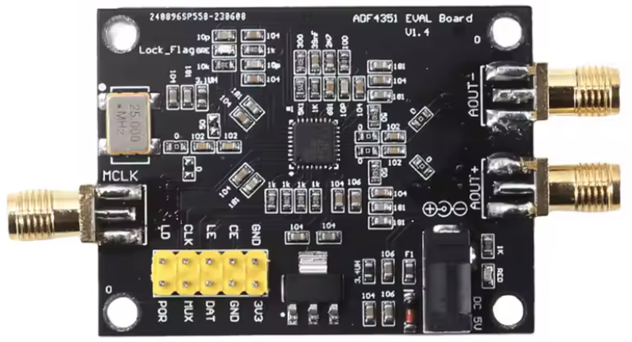
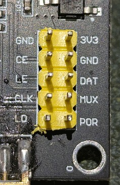
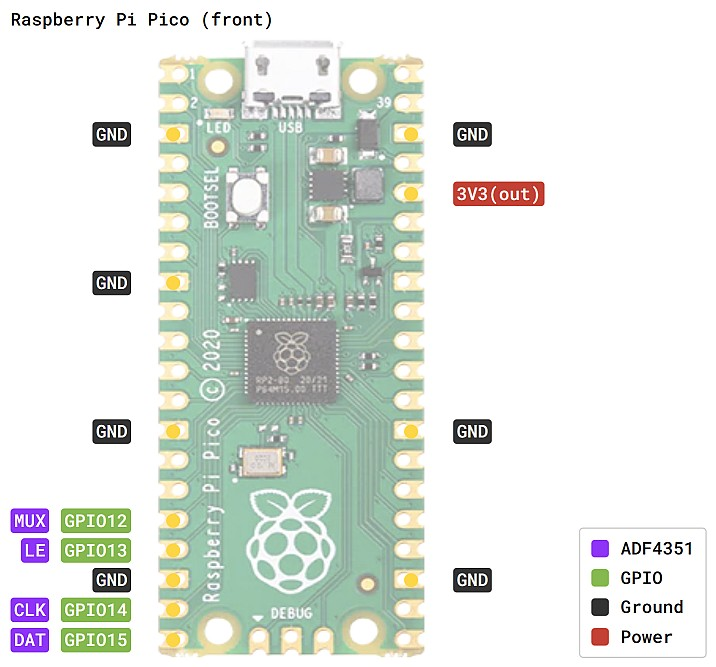

# **ADF4351 Raspberry Pi Pico Python Library**

This library provides a simple way to interface with the ADF4351 Voltage Controlled Oscilator Evaluation Modules. It is pased on the pyadf435x project with an additional wrapper to make setting a frequency super easy. More functionality will likely be added in future versions like setting the output power level for example.

The modules have an Analog Devices IC (ADF 4351) that can generate signals between 35MHz and 4.4GHz. This code is not tested with the ADF4350 chip.



**Compatiblity**: This code is not compatible with the module with the screen and buttons as the built in microprocessor interfaces with the VCO IC directly, and is only compatible with the eval/development boards that provide direct interfacing to the ADF4351. 

## Using this library

To use this library copy the adf4351 directory onto your Raspberry Pi Pico


## References

Link to the Analog Devices ADF4351 Data Sheet: https://www.analog.com/media/en/technical-documentation/data-sheets/adf4351.pdf

Link to these ADF4351 Eval/Development boards: 
https://vi.aliexpress.com/w/wholesale-adf4351-development-board.html

NOTE: We don't cover the RF side or implementation of the ADF 4351 in this guide, only setting up and using this library to control the VCO


## Connection

This is the hookup for the ADF4351 Module to the Raspberry Pi Pico

| ADF4351   | Pico        |
| --------- | ----------- |
| CLK       | GPIO 14     |
| LE        | GPIO 13     |
| DAT       | GPIO 15     |
| MUX       | GPIO 12     |
| GND       | GND         |
| GND       | GND         |
| 3V3       | 3V3         |
| CE        | tied to 3v3 |
| LD        | not used (goes high if PLL is locked)  |
| POR       | not used    |






## **Example Code**

This code works on any Rapsberry Pi Pico using Python

```
import adf435x
import time

# Set the Frequency
freq = 433  # MHz
adf435x.setfrequency(freq)

# Enable the Output
adf435x.enable()

print(f"Is the oscilator Locked: {adf435x.get_locked()}")

sleep(10)

# Disable the Output
adf435x.disable()
```